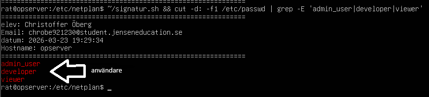
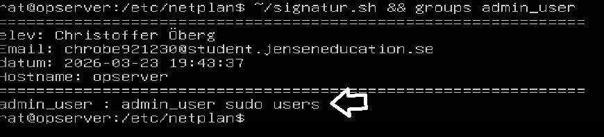
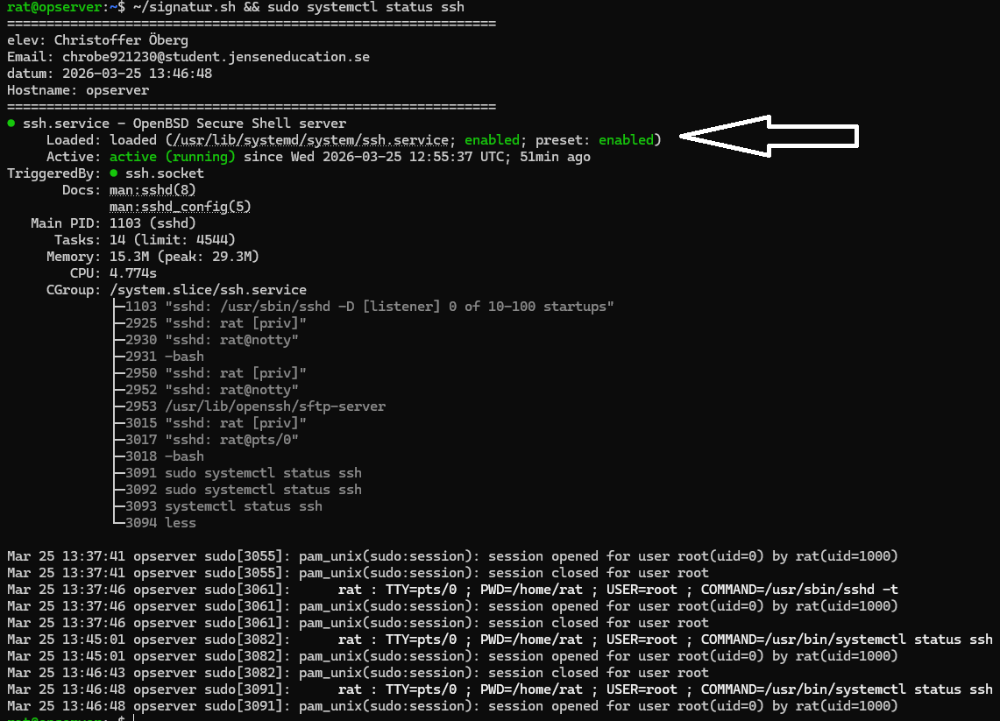
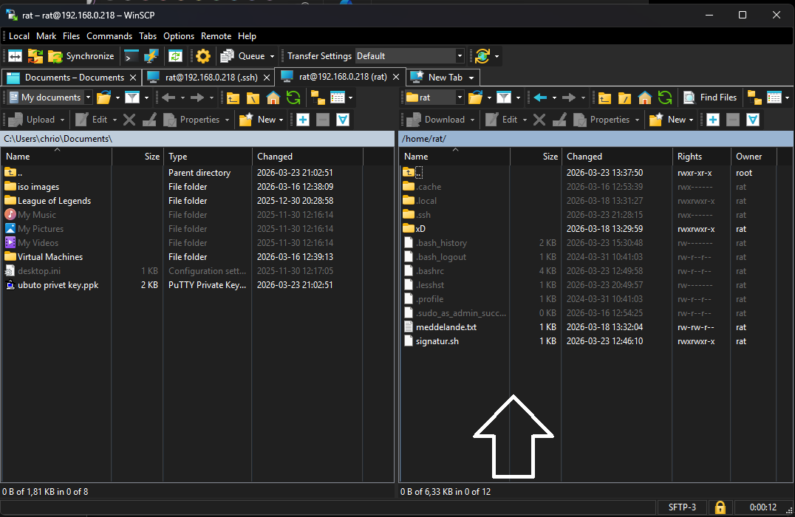
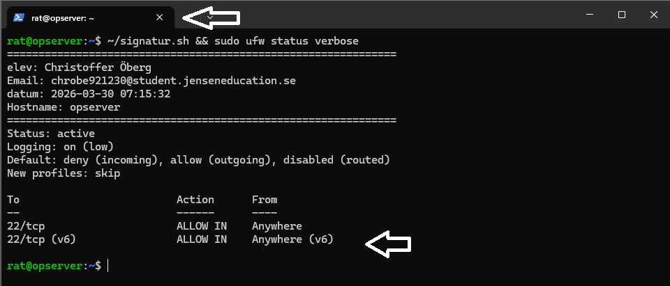
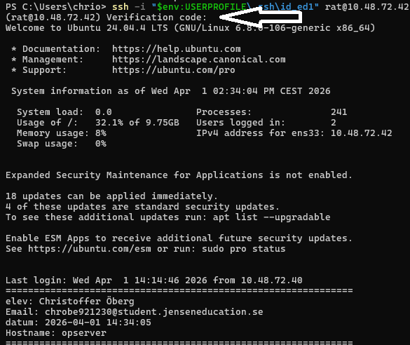
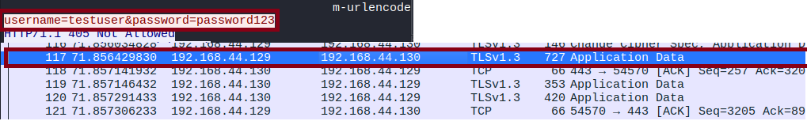

# Linux Security Lab

## Project Overview

This project demonstrates Linux server administration and security hardening techniques implemented in a practical lab environment.

The objective was to deploy, configure, and secure an Ubuntu Server while gaining hands-on experience with authentication, access control, firewall management, web security, and network traffic analysis.

The project was completed as part of a Network Security course and focuses on real-world tasks commonly performed by Linux System Administrators and Security Engineers.

---

## Technologies Used

* Ubuntu Server
* OpenSSH
* WinSCP
* UFW Firewall
* Google Authenticator
* Nginx
* HTTPS / TLS
* Wireshark
* tcpdump

---

## User Administration

User accounts were created and managed using standard Linux administration practices.

Administrative privileges were assigned through the sudo group to ensure secure privilege escalation while maintaining accountability.

### Demonstrated Skills

* User account management
* Linux permissions
* Sudo administration
* Access control

The screenshot above demonstrates the creation and management of Linux user accounts.

The screenshot above verifies that the administrative user was successfully assigned sudo privileges.

---

## SSH Hardening

Remote administration was secured using OpenSSH.

Password-based authentication was replaced with SSH key authentication to reduce the risk of brute-force attacks and credential theft.

### Security Measures Implemented

* SSH key authentication
* Secure remote administration
* Service verification
* SSH configuration management

### Demonstrated Skills

* SSH administration
* Public/private key management
* Secure remote access
* Linux server management

The screenshot above verifies that the SSH service is enabled and running correctly.

The screenshot above demonstrates successful SSH key-based authentication using WinSCP.

---

## Firewall Configuration

A host-based firewall was configured using UFW (Uncomplicated Firewall).

Only required services were permitted, reducing the attack surface of the server.

### Demonstrated Skills

* Firewall configuration
* Access control
* Service protection
* Security hardening

The screenshot above shows the active firewall configuration protecting the server.

---

## Multi-Factor Authentication (MFA)

Multi-Factor Authentication was implemented using Google Authenticator.

This added an additional layer of security by requiring both valid credentials and a time-based authentication code.

### Demonstrated Skills

* Identity and Access Management
* MFA implementation
* Authentication security
* Linux security administration

The screenshot above demonstrates successful multi-factor authentication using Google Authenticator.

---

## Web Security

A web server was deployed using Nginx and tested using both HTTP and HTTPS.

Packet captures were analyzed to demonstrate the security benefits of encrypted communications.

### Key Findings

HTTP traffic exposes information in plain text and can be inspected by anyone with access to the network.

HTTPS protects communication through TLS encryption, preventing sensitive information from being viewed during transmission.

### Demonstrated Skills

* Web server deployment
* HTTPS implementation
* TLS encryption
* Security analysis
* Traffic inspection

This packet capture demonstrates how sensitive information can be visible in clear text when HTTP is used.

This packet capture demonstrates how TLS encryption protects communication when HTTPS is used.

---

## Network Analysis

Network traffic was analyzed using Wireshark and tcpdump.

Traffic captures included:

* ICMP
* TCP Handshakes
* DHCP DORA Process
* HTTP Traffic
* HTTPS Traffic

This provided practical insight into how network communication works and how security controls affect network visibility.

### Demonstrated Skills

* Packet analysis
* Protocol troubleshooting
* Network monitoring
* Security validation
* Traffic analysis

---

## Learning Outcomes

This project provided practical experience in:

* Linux Administration
* User and Permission Management
* SSH Hardening
* Multi-Factor Authentication
* Firewall Configuration
* HTTPS and TLS
* Packet Analysis
* Network Security Fundamentals

---

## Conclusion

The project successfully demonstrated how a Linux server can be secured using multiple layers of protection, including strong authentication, firewall rules, encrypted communications, and security monitoring.

The knowledge and skills developed during this project are directly applicable to System Administration, Cloud Operations, and Cybersecurity roles.
